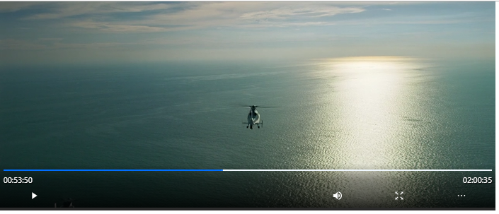

# Reactjs Media 
__Note:__ We recommend installing `v1.1.2` and above.


The reactjs media is a react package with awesome HTMLMediaElements that are recreated into react components.
It is developed by [Beingana Jim Junior](https://www.twitter.com/_jimjunior_) a front end Developer. The source code can be found on [Github](https://github.com/jimjunior44/reactjs-media)

It includes currently only has a video component.

#### Installation

To install go to your terminal and run this script

```bash
$ npm install reactjs-media
```
If your see no error then is is Installed.

#### Setup 

In here we shall show a small demo on how to setup a simple video component. We shall create the default component.

```jsx
import React from 'react';
import { ReactVideo } from 'reactjs-media/video';

const App = () => {
    return (
        <div>
            <MyVideo />
        </div>
    )
}

const MyVideo = () => {
    return (
        <>
        <div>
            <ReactVideo
            src='https://www.example.com/myvideo.mp4'
            />
        <div/>
        </>
    )
}

```

The above code will create a video componet that looks like this:



The video component can be customised and there are a vriety of hooks to use it. You can find them in the official [Documentation](https://blurify.ml/projects/reactjs-video "Documentation").

